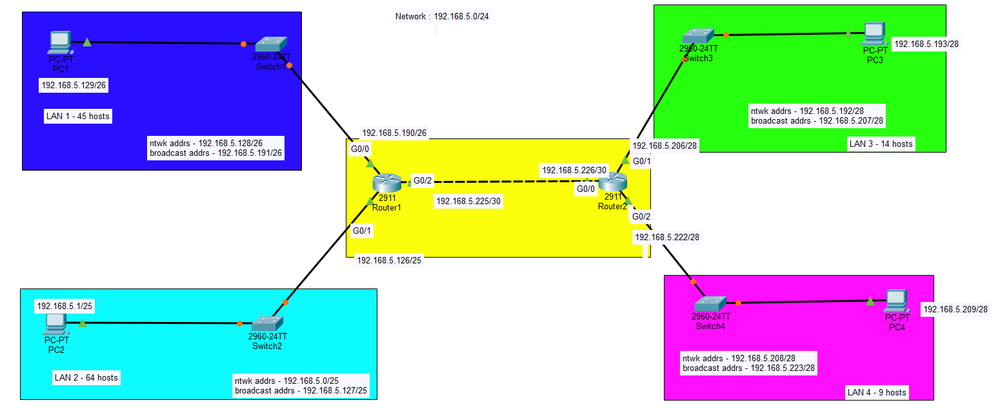

# Cisco Packet Tracer: VLSM Network Subnetting & Routing

## 📌 Project Overview
This project demonstrates an optimized network topology using **Variable Length Subnet Masking (VLSM)** to efficiently allocate IPv4 addresses across four distinct Local Area Networks (LANs) and a Point-to-Point WAN connection. The design minimizes IP address wasting using a base network of **192.168.5.0/24** across two **Cisco 2911 Routers** and **Cisco 2960 Switches**.

## 🛠️ Network Components & Technologies
* **Simulation Software:** Cisco Packet Tracer
* **Hardware utilized:** 2x Cisco 2911 Routers, 4x Cisco 2960 Switches, End-user PCs
* **IP Addressing Strategy:** VLSM (Variable Length Subnet Masking)
* **Core Routing Method:** Static Routing

---

## 📊 Subnetting Scheme & IP Addressing Table

| Subnet / LAN | Required Hosts | Network Address | Subnet Mask / CIDR | Broadcast Address | Router Interface | Router Gateway IP |
| :--- | :--- | :--- | :--- | :--- | :--- | :--- |
| **LAN 2 (Cyan)** | 64 hosts | `192.168.5.0` | `255.255.255.128` (/25) | `192.168.5.127` | Router1 - G0/1 | `192.168.5.126` |
| **LAN 1 (Blue)** | 45 hosts | `192.168.5.128` | `255.255.255.192` (/26) | `192.168.5.191` | Router1 - G0/0 | `192.168.5.190` |
| **LAN 3 (Green)** | 14 hosts | `192.168.5.193` | `255.255.255.240` (/28) | `192.168.5.207` | Router2 - G0/1 | `192.168.5.206` |
| **LAN 4 (Pink)** | 9 hosts | `192.168.5.208` | `255.255.255.240` (/28) | `192.168.5.223` | Router2 - G0/2 | `192.168.5.222` |
| **WAN Link (Yellow)** | 2 hosts | `192.168.5.224` | `255.255.255.252` (/30) | `192.168.5.227` | Router1-to-2 G0/2 | `192.168.5.225` / `.226` |

---

## 🛣️ Static Routing Configuration
To establish communication across both routers, the following static routes were configured via the global configuration mode terminal:

### Router 1 Configuration (Targeting Router 2 subnets)
```bash
Router1(config)# ip route 192.168.5.192 255.255.255.240 192.168.5.226
Router1(config)# ip route 192.168.5.208 255.255.255.240 192.168.5.226
```

### Router 2 Configuration (Targeting Router 1 subnets)
```bash
Router2(config)# ip route 192.168.5.0 255.255.255.128 192.168.5.225
Router2(config)# ip route 192.168.5.128 255.255.255.192 192.168.5.225
```

---

## 🖼️ Network Topology Map
Below is the architectural layout showing the structural categorization of the subnets:



---

## 🚀 Verification and Connectivity
* Fully verified end-to-end IP routing paths.
* Validated broadcast domains across all four isolated switch networks via successful ICMP pings.
